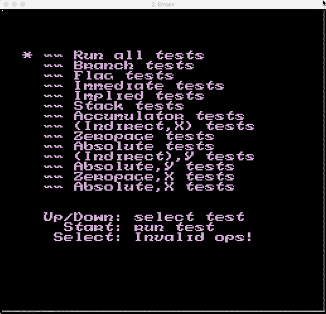
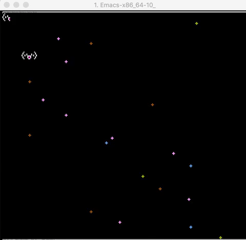

A NES Emulator
==========

| [nestest.nes](https://wiki.nesdev.com/w/index.php/Emulator_tests) | [giko011.nes](http://gikofami.fc2web.com/nes/nes011.html)  (insufficient) |
| --- | --- |
|  |  |

Requirements
----------

Emacs 25 or higher

Usage
----------

TODO
